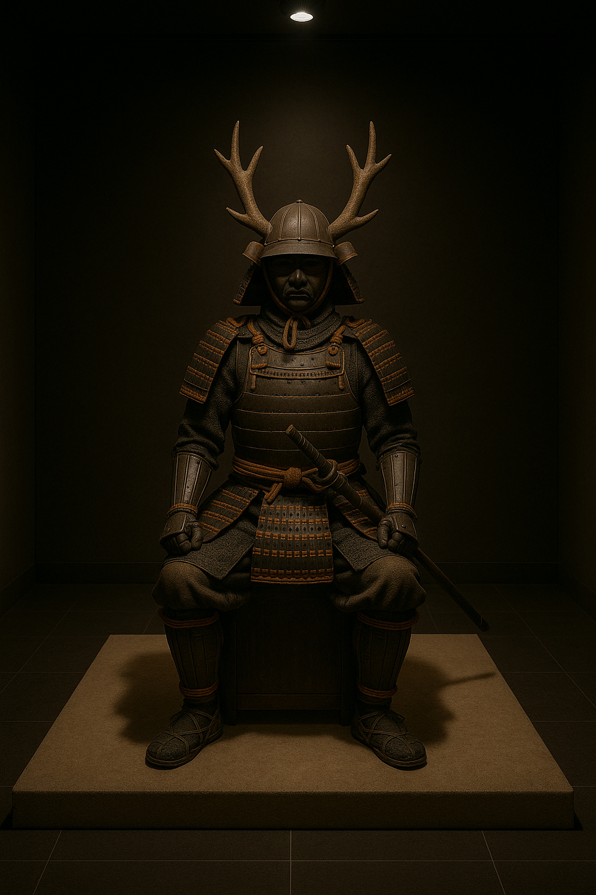

# From Warring States to Castles in the Sky: The Azuchi–Momoyama Period

*Previously in our series…*  We left the Muromachi era with Kyoto in ashes, warlords squabbling like cats over a fish, and a country that had forgotten what a central government looked like.  The **Ōnin War** had shattered the Ashikaga shogunate and turned the capital into a charred memory.  Bands of warrior‑monks, league‑towns and independent daimyō carved up the land while the emperor wrote poetry in exile.  The period that followed was called **Sengoku** – the "Warring States" – and it was as chaotic and violent as it sounds.  But just when it seemed Japan would remain a mosaic of petty states forever, two men appeared who would unify the country, build splendid castles, and leave a legacy that still towers over Japanese culture.  Welcome to the **Azuchi–Momoyama period**.

## A Country in Pieces

By the mid‑1500s, central control existed only on paper.  Power resided in the hands of daimyōs whose castles dotted the landscape, each fielding private armies and scheming for advantage.  In previous posts we have seen how Zen aesthetics, tea ceremonies and temple gardens flourished despite the carnage of the Muromachi years.  Now the battlefield moved from poetry circles to fortified slopes.  Farmers reinforced their houses with palisades; merchants took up arms alongside samurai; and warrior monks (sōhei) waged holy war from mountain monasteries.  Missionaries from Portugal and Spain brought muskets and Christianity, adding European gunpowder and theology to the mix.  Something had to give.
## Oda Nobunaga: A Lord Like No Other
At the centre of the maelstrom strode **Oda Nobunaga**, a ruthless warlord with a love of innovation and a penchant for unconventional tactics.  Nobunaga came from Owari province (modern Aichi), a backwater by Kyoto standards.  Yet his ambition was boundless.  In 1568 he marched on Kyoto, installed a puppet shogun, and made himself the power behind the throne.  It was a breathtaking move – one that signalled to rival daimyōs that a new player had arrived.  Nobunaga’s rise is legendary and peppered with colourful anecdotes.  He reputedly tossed a bowl of rice at a visiting warlord for failing to address him properly, earning the nickname **"Owari’s Fool"**, but this fool was not to be trifled with.
### Musket Volleys and Monk Massacres
One of Nobunaga’s great advantages was his willingness to adopt new technology.  Portuguese traders had introduced the **arquebus**, a matchlock musket, to Japan in the 1540s.  Traditional samurai mocked the clumsy firearms, but Nobunaga saw their potential.  At the **Battle of Nagashino** in 1575 he deployed lines of musketeers protected by wooden palisades, firing in volleys while mounted samurai charged and fell.  This tactic decimated the Takeda clan’s famed cavalry and demonstrated that gunpowder could trump swordsmanship.  It was a **paradigm shift** in Japanese warfare.
Not all of Nobunaga’s innovations were as laudable.  To consolidate his hold on central Japan he targeted the **Buddhist military orders**.  The mountain fortress temple **Enryakuji** on Mount Hiei had been a thorn in Kyoto’s side for centuries.  In 1571 Nobunaga’s armies surrounded the monastery and set it ablaze.  According to chroniclers, **25,000 men, women and children were killed**.  He later destroyed the fortress of **Ishiyama Hongan‑ji**, home of the militant **Ikkō‑ikki** sect, after a long siege.  The brutality shocked contemporaries and remains controversial.  Yet by removing these autonomous militias, Nobunaga cleared the path for national unification.
### Castles and Commerce: The Azuchi Experiment
Nobunaga understood that power required not just the sword, but also the purse.  He encouraged **free trade**, issued market regulations that protected merchants, and welcomed foreign traders.  His alliance with Jesuit missionaries – in exchange for access to Portuguese guns and goods – shows a pragmatic streak.  He built **Azuchi Castle** near Lake Biwa, a towering, seven‑story keep painted in gorgeous colours and topped with a golden shachihoko (mythical fish).  Part palace, part fortress, Azuchi served as his command centre and as a statement that a new order had arrived.  Unlike the sombre Zen gardens of the Muromachi era, Azuchi gleamed like a jewel, impressing visitors and intimidating rivals.
Nobunaga also instituted the **"sword hunt"**, confiscating weapons from peasants to prevent uprisings.  He ordered comprehensive **land surveys** to calculate taxes and solidify his revenue base.  In these policies we see the beginnings of a more centralized state, where the ruler collects taxes and monopolizes violence – hallmarks of modern governance.  But even heroes of unification are vulnerable to betrayal.  In 1582, while resting at **Honnō‑ji** temple in Kyoto, Nobunaga was attacked by his own vassal **Akechi Mitsuhide**.  Surrounded and outnumbered, he set fire to the temple and committed seppuku.  Within twenty years he had risen from provincial lord to near‑unifier of Japan.  His death left a power vacuum that quickly filled.
## Toyotomi Hideyoshi: From Barnboy to Regent
Enter **Toyotomi Hideyoshi**, the ultimate rags‑to‑riches story.  Born the son of a peasant foot soldier, Hideyoshi rose through Nobunaga’s ranks thanks to his talent, charisma and cunning.  After Nobunaga’s demise, Hideyoshi avenged his lord by defeating Mitsuhide at the **Battle of Yamazaki**.  Over the next decade he outmanoeuvred rival daimyōs, conquered Western Japan, and in 1590 forced the last holdout, the Hōjō clan, to surrender at **Odawara Castle**.  He never took the title of shōgun (his peasant birth barred him), so he persuaded the court to name him **Kampaku (regent)**.  He controlled the emperor and the court, effectively ruling Japan.
### Building Castles, Building Order
Hideyoshi inherited Nobunaga’s penchant for monumental construction and took it to new heights.  He completed **Osaka Castle**, a massive fortress with stone walls and gold leaf decoration.  He rebuilt **Himeji Castle** and constructed **Fushimi‑Momoyama Castle**, which gave the **Momoyama** part of the period its name.  He even encircled Kyoto with a defensive **earthen rampart** (the **Ōdoi**).  These projects were expensive and labour‑intensive, but they projected power and gave work to thousands.  Artisans, carpenters and stone‑masons flocked to build the towering keeps that still stand today as UNESCO heritage sites.
### Class Lines and Social Engineering
To stabilise his regime Hideyoshi reshaped society.  He ordered a **comprehensive census and land survey**, redefining who was samurai, farmer, artisan or merchant.  People were forbidden to change professions; samurai could no longer farm; peasants could not carry weapons.  The result was a rigid **four‑class system** (shi-no-kō-shō).  Hideyoshi believed this hierarchy would prevent uprisings and ensure tax revenue.  It also cemented the gulf between warriors and commoners, shaping Japanese social structure for centuries.
Hideyoshi continued Nobunaga’s **sword hunt**, collecting weapons from farmers to disarm potential rebels.  While marketed as a way to melt swords into a giant Buddha statue, it was above all a pragmatic power move.  He took steps to restrict Christianity; after initially allowing missionaries to operate, he issued **expulsion orders** in 1587 and later executed **26 Christians** in Nagasaki in 1597.  This signalled a shift from Nobunaga’s openness to a more cautious, even hostile stance towards foreign influence.
### Tea Ceremonies and Temple Politics
Though he relished warfare and politics, Hideyoshi also participated in the era’s cultural renaissance.  He patronised the tea master **Sen no Rikyū**, whose wabi‑sabi aesthetic emphasised simplicity and humility.  Rikyū designed teahouses with low entrances forcing participants to bow, reminding samurai of their humanity.  Hideyoshi loved the tea ceremony, sometimes staging grand events with golden tea rooms and lavish décor – a far cry from Rikyū’s rustic ideals.  Their relationship soured; whether due to political intrigue or personal slight, Hideyoshi ordered Rikyū to commit seppuku in 1591.  The drama underscores the tension between power and aesthetic ideals in this era.
### Ambitions Beyond the Sea: The Korean Campaigns
Having unified Japan, Hideyoshi sought to conquer Ming China by way of the Korean peninsula.  In **1592** he launched an invasion of Korea with an army said to number **more than 150,000 troops**.  Japanese soldiers quickly occupied Seoul and Pyongyang, but they underestimated the logistical challenges and the **Korean navy**, led by Admiral Yi Sun-sin, whose turtle ships harassed their supply lines.  Ming China sent troops to aid Korea, turning the conflict into a quagmire.  Peace negotiations stalled; a second invasion in **1597** achieved little beyond further devastation.  The wars inflicted immense suffering on the Korean population and drained Japan’s resources.  One lasting, if tragic, effect was the **forced relocation of Korean potters** to Japan, sparking the development of Japanese porcelain.  Hideyoshi died in 1598, leaving the Korean campaigns unfinished and his five-year-old son Hideyori as heir.
## Cultural Renaissance Amidst Chaos
Despite the violence, the Azuchi–Momoyama period produced vibrant art and culture.  Castle architecture reached its zenith: multi‑story towers (tenshu) with sweeping eaves were decorated with gold leaf and imposing stone bases.  **Noh theatre** continued to evolve, while a new comic drama called **Kyōgen** provided comedic interludes.  **Painting** flourished under artists like **Kano Eitoku**, who created gilded folding screens depicting tigers, cypresses and landscapes.  The **tea ceremony** matured into a formalised ritual emphasising harmony, respect, purity and tranquility.  **Sculpture** and **metalwork** thrived, blending Zen restraint with Momoyama opulence.  It is no accident that many of Japan’s most treasured national treasures date from this era.  Even as armies marched and temples burned, creativity blossomed.
## The Curtain Falls: Sekigahara and Legacy
The death of Hideyoshi created a power vacuum.  His council of regents could not agree on a successor; factions formed around **Tokugawa Ieyasu** and **Ishida Mitsunari**.  In **1600** their armies met at **Sekigahara**, a fog‑shrouded valley in western Honshu.  Through treachery, timely defections and sheer luck, Tokugawa Ieyasu prevailed.  Mitsunari was executed, and the Toyotomi clan’s influence waned.  Three years later Ieyasu was named shōgun, inaugurating the **Tokugawa (Edo) shogunate** that would rule for two and a half centuries.  The Azuchi–Momoyama period thus sits as a bridge between medieval fragmentation and early modern stability.
## Reflection: What Makes the Azuchi–Momoyama Period Unique?
This era is short – roughly **1568 to 1600** – but its impact is outsized.  It is the story of two men with extraordinary drive who dragged Japan out of the Sengoku quagmire.  Nobunaga was the iconoclast who embraced firearms, crushed old power bases, and opened markets.  Hideyoshi was the consummate politician who used charisma, marriage alliances and diplomacy to finish the job while crafting a social order that lasted centuries.  Their policies – sword hunts, class stratification, land surveys – laid the groundwork for Tokugawa authority.  Yet there is more: the period’s castles still draw tourists; its art graces museums; its tea ceremony underpins Japanese hospitality.  The tragedy of temple massacres, persecution of Christians and Korean invasions reminds us that unification came with a heavy price.
For our purposes, the Azuchi–Momoyama period is an essential chapter in Japan’s journey.  It ties the **Muromachi** era’s cultural innovations to the **Edo** period’s stability.  Without the audacity of Nobunaga and the determination of Hideyoshi, there would be no tranquil golden age under the Tokugawa.  Next time, we’ll step into that age of peace, isolation and ukiyo‑e prints to see how the shōgunate consolidated the world they inherited.
## Footnotes
1. **Musket revolution and temple massacres** – Nobunaga’s adoption of arquebuses and his brutal attacks on Enryakuji and Ishiyama Hongan‑ji are documented in accounts of his campaign.
2. **Hideyoshi’s building projects and ramparts** – Hideyoshi ordered the construction of Osaka Castle, rebuilt Himeji and Fushimi‑Momoyama Castles, and erected the Ōdoi defensive earthwork around Kyoto.
3. **Class reforms and anti‑Christian edicts** – Hideyoshi’s land surveys, rigid class system and expulsion orders against missionaries – culminating in the execution of 26 Christians in 1597 – illustrate his social engineering.
4. **Korean invasions and cultural consequences** – Hideyoshi’s two invasions of Korea involved massive armies and logistical failures; the campaigns led to large-scale devastation and the transfer of Korean artisans to Japan.
5. **Onin War and Muromachi context** – The Ōnin War (1467‑1477) devastated Kyoto and initiated the Sengoku period; it provides the chaotic backdrop from which the Azuchi–Momoyama unification emerged.
## References
- **Oda Nobunaga** – Encyclopaedic overview of Nobunaga’s life and policies, highlighting his capture of Kyoto, adoption of firearms, land surveys, sword hunts and destruction of Buddhist temples.
- **Toyotomi Hideyoshi** – Biography covering Hideyoshi’s rise from peasant to regent, his building programmes (Osaka, Himeji, Fushimi), social reforms (shi‑no‑kō‑shō class system, sword hunts), anti‑Christian measures and invasions of Korea.
- **Azuchi–Momoyama Period Timeline** – Timeline listing major events such as Nobunaga’s capture of Kyoto, the Battle of Nagashino, construction of Azuchi Castle, Hideyoshi’s edicts, and the Battle of Sekigahara.
- **Muromachi Period and Ōnin War** – Accounts describing the Onin War’s devastation and the cultural achievements of the late Muromachi era, providing context for the subsequent unification.
