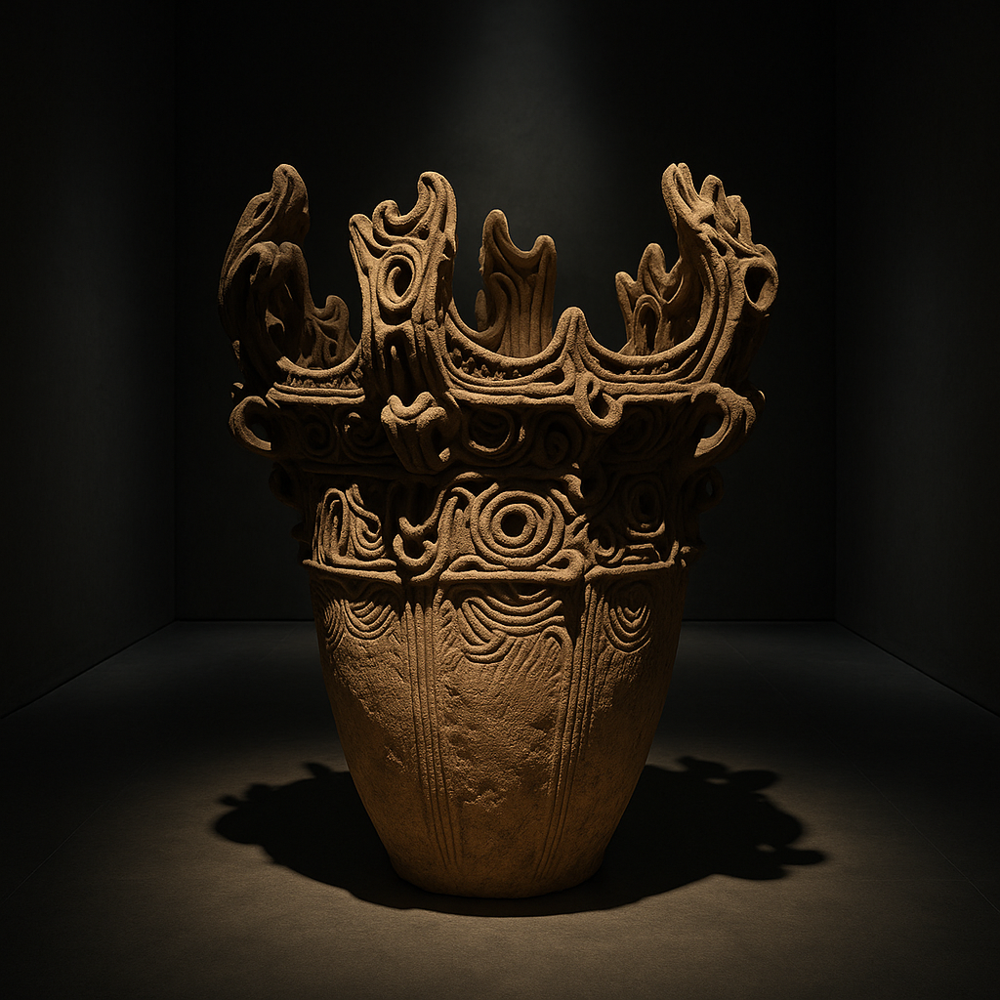

# The Cord‑Marked Chronicles: A Humorous Journey into Japan’s Jōmon Period

You may think history is all dusty scrolls and snooty academics, but the **Jōmon period** proves otherwise.  Imagine a prehistoric Japan where folks lived in cozy pit‑dwellings, sculpted mind‑boggling **flame‑rimmed pottery**, dabbled in **teeth removal** as a rite of passage and produced some of the world’s earliest clay figurines.  This article explores the fascinating Jōmon era (c. 14,500 BCE–300 BCE) with equal parts scholarship and sass.  Prepare for **cord‑marked pottery, dogū figurines, climate change drama** and a finale featuring rice farming – because even prehistory knows how to throw a cliff‑hanger.
## Who Were the Jōmon People?
The term *Jōmon* means **“cord‑marked”**, referring to the rope‑like impressions pressed into their pottery [9].  Archaeologists see this era as **Japan’s Neolithic period**; it encompasses an enormous stretch of time from roughly 14,500 BCE to 300 BCE.  These people were **semi‑sedentary hunter‑gatherers** who lived in **pit dwellings** arranged around central plazas, surviving on a diet of gathered plants, wild game and fish [1].  They lacked a written language, so their story must be pieced together from shell mounds and potsherds.  Picture tens of thousands of years of family gossip, gossip we can only infer from discarded clam shells.
## Prehistoric Property Brothers: Pit Dwellings & Daily Life
Life in Jōmon Japan was not as bleak as a caveman cartoon.  The people built **half‑buried houses** with hearths in the floor for warmth and cooking [1].  These dwellings were grouped into villages near rivers and coasts, because why not enjoy a beach view?  Initially, they were simple surface huts, but as we reach the **Middle Jōmon**, houses became more elaborate, with **stone‑paved floors** and separate walls and roofs [6].  Imagine upgrading from a tent to a charming stone‑floored bungalow.  Thatch and other reeds served as roofing, while walls were packed with clay or bark.  This architectural evolution hints that the Jōmon people had time for DIY improvements—perhaps the world’s first home‑makeover show.
Food came from the **land and sea**.  Shell mounds reveal that **shellfish** were a staple, joined by deer, boar, rabbit and duck [4].  Seasonal rhythms shaped their menu: hunting boar and deer in winter, gathering greens and fishing in spring, catching fish in calm summer seas and collecting nuts and berries in autumn [4].  Warm periods allowed them to venture into mountains or travel along the coast in search of resources [3].  Evidence from **Kyūshū** suggests that nut preparation – particularly chestnuts – was a central part of their diet [4].
## The Potter’s Wheel? We Don’t Need It!
One of the Jōmon people’s biggest claims to fame is **pottery**.  They produced some of the **oldest known ceramics** in the world, forming each vessel by hand from soft clay.  Potters built up the walls coil by coil, mixing the clay with mica, lead, fibers or crushed shells to add strength [2].  The vessels were then fired in **open bonfires** at about **900 °C**, making them durable enough for cooking and storage [2].  Their earliest pots had **pointed bottoms** (useful for sticking them in the ground or in the sand) and were decorated with simple cord impressions.  As time went on, decoration became more elaborate, culminating in the spectacular **“flame‑rimmed” bowls** of the Middle Jōmon period [3].
The pottery served many purposes: cooking, storing food, making ceremonial offerings and perhaps showing off at village potlucks.  Women likely made the pots, using tools to smooth surfaces and carve patterns.  If you think your sourdough starter has history, consider these clay masterpieces – they predate the wheel and yet display intricate artistry.
## The Many Phases of Jōmon Life
Because the Jōmon period spans more than ten millennia, scholars divide it into phases based on climate shifts and cultural developments [3].  Let’s take a whirlwind tour:
### 1. Incipient Jōmon (ca. 10,500–8000 BCE)
As the last Ice Age waned, people lived in surface dwellings and hunted large game.  They created **deep cooking pots** with cord impressions – among the world’s oldest pottery [3].  Rising sea levels soon transformed Japan into an archipelago, stranding populations on islands and forcing them to adapt [4].  Obsidian mining indicates they were resourceful tool‑makers [4].  When the big animals disappeared, they turned to plants, nuts and seafood [4].
### 2. Initial Jōmon (ca. 8000–5000 BCE)
Warmer climates brought an abundance of nuts, fish and small game; populations grew.  People along Kyūshū developed extensive **nut preparation** techniques [4], while coastal communities harvested shellfish, leaving behind massive shell heaps [4].  People moved with the seasons: hunting in winter, gathering greens in spring, fishing in summer and collecting nuts in autumn [4].
### 3. Early Jōmon (ca. 5000–2500 BCE)
Pottery became more **intricate** as earthenware culture blossomed [5].  Limited agriculture appeared; the Jōmon tended **lacquer groves** and grew bottle‑gourd, soybeans, hemp and other crops [5].  Some evidence suggests early **peach cultivation**.  With more abundant food and warmer climate, populations expanded and settlement patterns diversified [5].
### 4. Middle Jōmon (ca. 2500–1500 BCE)
This period marks the **cultural peak** of the Jōmon.  Communities grew larger; houses became sophisticated with stone floors and separate roofs [6].  The climate warmed significantly, prompting people to move into the mountains where they hunted, fished and collected forest products [3].  The population may have reached hundreds of thousands.  Artistic expression flourished: potters crafted **flame‑rimmed vessels** and ornate jars decorated with animal motifs; **clay beads** and **dogū figurines** appeared as grave goods and ritual objects [6].  Shell mounds were used for burials, suggesting a growing ritual life [3].
### 5. Late Jōmon (ca. 1500–1000 BCE)
As the climate cooled, communities moved back to coastal plains and relied more on fishing.  They invented **toggle harpoons** and deep‑sea fishing techniques [3].  Stone circles comprised of thousands of assembled stones served as ceremonial sites [3].  Houses evolved from round to square or rectangular structures with **packed mud floors** and indoor fire pits [7].  Dogū figurines – stylized human and animal figures often intentionally broken – became increasingly common [6].  The prevalence of **magatama** (comma‑shaped beads) indicates a thriving craft industry [7].
### 6. Final Jōmon (ca. 1000–300 BCE)
Cooling climate and dwindling resources led to a **population decline** [3].  Smaller groups developed regional differences in pottery and settlement patterns.  Evidence of **dry‑bed rice cultivation** appears toward the end of this phase, signifying the **transition to the Yayoi culture** [3].  Jōmon society did not simply vanish; instead, new waves of migrants from the Korean peninsula brought new technologies and mingled with indigenous peoples [7].  This cultural fusion birthed the Yayoi period, with wet‑rice agriculture and metalworking.
## Of Figurines and Tooth Fairies: Rituals and Beliefs
One of the most intriguing aspects of the Jōmon era is its **ritual life**.  The increased production of **female figurines and phallic images** during the Middle and Late Jōmon suggests a belief system centered on fertility and nature [6].  These clay figures, known as **dogū**, come in various shapes—from heart‑shaped faces to goggle‑eyed “Venus” types.  Many show exaggerated body parts and are decorated with patterns.  Archaeologists propose that dogū were **used for sympathetic magic**: to absorb illnesses or misfortunes, then intentionally broken and discarded [6].  Several were found in trash heaps with missing limbs, indicating they were deliberately “sacrificed.”
Another striking practice is **tooth ablation**.  Around **80–90%** of Late Jōmon skulls show teeth intentionally removed, likely as a **rite of passage** for adolescents or a symbol of marital status [7].  That’s right—the Jōmon people literally pulled teeth for cultural reasons long before modern braces.  Talk about taking “no pain, no gain” to a new level!
Burial practices also hint at belief systems.  Bodies were sometimes interred in the very **shell mounds** that communities created by discarding seafood remains [3].  Stone circles may have served as communal ritual grounds [3].  These sites reveal a society deeply connected to both the earth and the sea, honouring ancestors and nature through ceremony.
## Climate Change Drama: Adapting to a Changing World
Throughout the Jōmon period, **climate change** plays a starring role.  Early on, the warming climate raised sea levels, separated Japan from Asia and forced people to adapt to island life [4].  During the Middle Jōmon, temperatures peaked, prompting migrations into mountainous areas and supporting larger populations [3].  However, the Late and Final phases saw cooling and resource decline, leading to population shrinkage and more regional variation [3].  This long‑term dance with climate demonstrates the Jōmon people’s resilience and ability to innovate – from adopting new fishing methods to experimenting with agriculture.
## The Beginning of the End: Rice and Metallurgy on the Horizon
By around **300 BCE**, communities in western Japan began cultivating domesticated **rice**, possibly in swamps or dry fields [3].  This agricultural innovation likely came with migrants from mainland Asia, who brought wet‑rice farming and metalworking.  The combination of **new technologies**, **different pottery styles** and **social structures** marks the transition to the **Yayoi period**.  Yet the Jōmon people did not disappear; they blended with the newcomers, leaving a genetic legacy that still lives on.  Studies estimate that modern **Yamato Japanese** carry roughly **30% paternal, 15% maternal and 10% autosomal Jōmon DNA** [8].  In other words, those ancient cord‑marked potters are literally in the blood of most Japanese people today.
## Why the Jōmon Period Matters
The Jōmon era is more than just a prehistoric footnote; it is a **foundational chapter** in the story of Japan.  These people developed some of the **world’s oldest pottery**, adapted to massive environmental changes and pioneered ritual practices that echo through centuries.  Their **artistic flair** is evident in flame‑rimmed pottery and whimsical dogū figurines, while their resilience shines through their adaptation to climate swings and changing resources.  The Jōmon story also reminds us that human history is rarely a neat linear progression; it is a tapestry of migrations, environmental pressures, innovation and cultural exchange.
On a lighter note, the Jōmon period is proof that prehistoric people had style.  They decorated their pots with cords, created jewelry, built comfortable houses and even engaged in body modification.  If time travel were possible, an episode of **“Jōmon Home Makeover”** might be a hit: watch as a family upgrades from a pit hut to a stone‑floored lodge, complete with hanging dogū charms!
## Conclusion
The Jōmon period may be shrouded in mystery, but it continues to captivate archaeologists, artists and history buffs.  Its people left behind an abundance of pots, beads and figurines that tell stories of survival, creativity and belief.  From **Incipient** hunters chasing megafauna to **Late Jōmon** artisans crafting magatama and dogū, their world was rich and dynamic.  As we trace the threads from cord‑marked pottery to modern Japan, we see a continuity of cultural resilience.  So next time you admire a piece of Japanese pottery or a whimsical figurine, remember the Jōmon – the original artisans of the archipelago.

[Next - Yayoi Period](./yayoi_blog_post.md)

[Home](../toc.md)

---
## References
1. World History Encyclopedia, *Jōmon Culture* – description of Jōmon as Japan’s Neolithic period, semi‑sedentary pit dwellings and subsistence patterns.
2. World History Encyclopedia, *Jōmon Culture* – pottery manufacture methods using coils, adhesives and open‑bonfire firing.
3. Metropolitan Museum of Art, *Jōmon Culture (ca. 10,500–300 B.C.)* – phase divisions, climate changes and ritual practices.
4. TheCollector, *The Jōmon Period: Japan’s Mysterious Origin Story* – Ice Age migration, seasonal diets and nut consumption.
5. TheCollector – details on Early and Middle Jōmon pottery, limited agriculture and crop cultivation.
6. TheCollector – descriptions of Middle Jōmon art, house construction and ritual objects.
7. TheCollector – evidence of tooth ablation, housing changes and population decline in the Late Jōmon.
8. TheCollector – genetic legacy of the Jōmon people in modern Japanese populations.
9. Initial bullet‑point outline (task 1) – explanation of the Jōmon period name and introduction of rice farming toward the end.
---
*Note: Footnote numbers correspond to the citations listed above.  For readability, citations are included in brackets within the text.*
