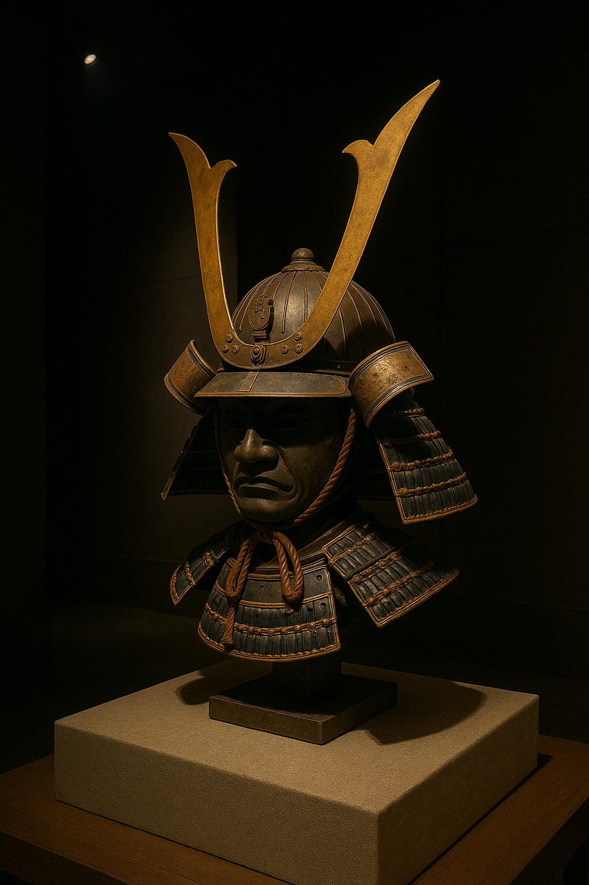

Bushido and Broken Temples: The Kamakura Period’s Warrior Rule and Spiritual Revolutions
=======================================================================================
## Introduction – When Poems Gave Way to Power

At the end of our last episode, the elegant world of the **Heian court** literally sank into the sea at **Dan‑no‑ura**.  The **Genpei War** washed away the Fujiwara’s scented sleeves and left behind muddy boots and broken arrows.  Emerging from this chaos was **Minamoto no Yoritomo**, who chose not to move into the old palaces of Kyoto but instead built a new seat of government far to the east in **Kamakura**.  It was as if England’s government abandoned London for a fortified cliff in Cornwall.  Thus begins the **Kamakura period** (1185–1333), an era defined by warrior rule, foreign threats and spiritual transformation.
While the Heian court had perfected the art of **miyabi**—refined courtly elegance—its neglect of the provinces allowed warrior families to accumulate power.  Yoritomo and his followers were not novices; they had fought for their lives and lands during the Genpei War.  They valued loyalty, discipline and martial skill over poem composition.  Yet even as warriors seized power, new philosophies of **Zen** and **Pure Land** Buddhism offered solace, and law codes sought to bring order to an increasingly fractious society.  The Kamakura period is therefore a study in contrasts: austere, pragmatic governance paired with an intense search for spiritual meaning; brutal civil wars followed by contemplative tea ceremonies; and foreign invasions repelled by storms hailed as **kamikaze**, or divine winds.
## Establishing the Bakufu: Yoritomo’s New Order
### From Shining Prince to Shogun
After defeating the Taira in 1185, **Minamoto no Yoritomo** faced a dilemma.  If he returned to Kyoto and became a court noble, he risked being absorbed by the same bureaucratic world that had suffocated his warrior kin.  Instead, he set up his **bakufu**—literally, **“tent government”**—in Kamakura, a remote coastal city surrounded by mountains on three sides and facing the sea on the fourth.  From this defensible position, he appointed **military governors (shugo)** and **stewards (jitō)** to oversee provinces and estates, thereby bypassing the Kyoto bureaucracy.  In **1192**, he received the title **Sei‑i Taishōgun** (“barbarian‑subduing generalissimo”) from the emperor, formalising his rule.
Yoritomo’s government represented a new political experiment.  The imperial court remained in Kyoto as a ceremonial authority, but real power lay in Kamakura.  The **dual structure**—with an emperor in Kyoto and a shogun in Kamakura—allowed the Minamoto to rule while maintaining nominal imperial legitimacy.  It also reflected pragmatism: many provinces were restive, and the court lacked the resources to control them.  The bakufu promised land and titles to loyal warriors, creating a network of vassalage reminiscent of European feudalism.
### The Hōjō Regents and Family Drama
Yoritomo’s rule was short; he died unexpectedly in **1199**, leaving two young sons.  Enter **Hōjō Masako**, Yoritomo’s formidable widow.  She shaved her head and became a nun—earning the nickname **“Ama Shōgun”** (“nun shogun”)—but continued to pull political strings.  The Minamoto clan soon suffered a series of mysterious deaths; historians suspect Masako and her father, **Hōjō Tokimasa**, orchestrated the eliminations.  The Hōjō seized the regency, appointing themselves **shikken** (regents) to the shogun.  For the next century, real power in Kamakura would reside with the Hōjō.
Under **Hōjō Yasutoki** (regent 1224–1242), the bakufu codified its authority.  In **1232**, he issued the **Jōei Shikimoku** (Joei Code), a **51‑article legal code** governing inheritance, property disputes, land stewardship and vassal obligations.  This code emphasised practical justice over theoretical Confucianism, reflecting samurai values of loyalty, honesty and frugality.  It became the foundation for subsequent legal systems and demonstrates how the Kamakura rulers sought to stabilise society without relying on Heian precedents.
Not everyone accepted the new order.  In **1221**, the retired Emperor **Go‑Toba** launched the **Jōkyū War** (also known as the Jōkyū Disturbance) to overthrow the bakufu and restore imperial power.  The Kamakura forces, led by the Hōjō, crushed the rebellion, exiled Go‑Toba and confiscated estates from his supporters.  The war cemented the bakufu’s authority and further weakened the emperor’s ability to challenge samurai rule.
## Spiritual Revolutions: Zen, Pure Land and Nichiren
### Zen for Warriors
The Kamakura period was not all swords and intrigue; it also witnessed a **religious renaissance**.  While the Heian court had embraced Tendai and Shingon esotericism, the new warrior class found meaning in more **direct and practical forms of Buddhism**.  **Eisai** (also spelled Yōsai) traveled to China in 1168 and returned with a new school called **Rinzai Zen** in **1191**.  Rinzai emphasised sudden enlightenment through meditation and paradoxical riddles (koan).  Its austere discipline appealed to samurai, who saw parallels between Zen mindfulness and martial focus.
Around the same time, **Dōgen** journeyed to China and studied with the **Caodong** masters, bringing back **Sōtō Zen**.  Sōtō emphasised **shikantaza** (“just sitting”), stressing gradual awakening through continuous practice.  While Rinzai thrived under the patronage of shoguns and daimyo, Sōtō found followers among provincial warriors and rural folk.  Zen’s emphasis on self‑reliance and discipline resonated in an age when loyalty and personal virtue could mean the difference between life and death.
### Pure Land Hope and Nichiren’s Fury
Despite Zen’s growing popularity, many Japanese still felt unworthy of enlightenment through meditation alone.  Enter **Pure Land Buddhism**.  Propounded by **Hōnen** (1133–1212) and later systematised by **Shinran** (1173–1263), Pure Land taught that salvation was possible through **faith** in the compassionate **Amida Buddha**.  Reciting the **nembutsu** (chanting “Namu Amida Butsu”) with sincerity could ensure rebirth in the Western Paradise.  Pure Land found fertile ground among commoners and samurai who sought solace amid constant conflict.  Its inclusive message—anyone could be saved—contrasted with the elitist tone of earlier sects.
**Nichiren** (1222–1282) took a different approach.  Outspoken and uncompromising, he preached that the **Lotus Sutra** was the only true path to salvation.  In **1253**, he chanted **“Namu Myōhō Renge Kyō”** publicly, marking the birth of the **Nichiren sect**.  He criticised Zen and Pure Land schools as heretical and castigated the bakufu for its laxity.  His fiery sermons won him both adherents and enemies; he survived exile and assassination attempts.  Nichiren’s emphasis on faith and activism would later inspire movements for social justice, demonstrating that spirituality in the Kamakura period was anything but static.
## Challenges from Abroad: The Mongol Invasions
### Khubilai Khan’s Demands
Just when the Kamakura regime felt secure, danger loomed across the sea.  **Khubilai Khan**, the Mongol ruler of China, sent emissaries demanding Japan’s submission in **1268**.  The bakufu ignored these demands.  In retaliation, Mongol forces launched two invasions.  The first, in **1274**, consisted of some 23,000 troops and 300 large ships.  They landed at **Hakata Bay** in Kyushu, using superior bows and explosive rockets.  The Japanese samurai—accustomed to duels—struggled against massed archery.  Just as defeat seemed imminent, a **typhoon** struck, scattering the Mongol fleet.  The Japanese credited this “divine wind,” or **kamikaze**, with their salvation.
The second invasion in **1281** was even larger, with two armies totaling over 140,000 men.  The Japanese had not been idle; they built **stone walls** along Hakata Bay and organised coastal defenses.  For weeks, samurai launched nightly raids on the Mongol ships, preventing them from establishing a beachhead.  Again, a typhoon ravaged the Mongol fleet.  Tens of thousands of invaders drowned or were slaughtered when their ships were driven ashore.  The Mongol invasions ended not with a climactic battle but with weather and attrition.  While victorious, the bakufu faced a new problem: rewarding warriors who had fought but captured no spoils.  With no land to distribute, the government’s financial strain increased, sowing seeds of discontent.
## Internal Struggles and Decline
### Economic Pressures and Samurai Grievances
The cost of defense against the Mongols emptied the treasury.  The bakufu raised taxes and issued **paper money** that quickly devalued.  Samurai who had risked their lives expected rewards but received little.  Many turned to **moneylenders**, pledging their lands as collateral.  When debts mounted, some lost their estates, undermining their loyalty.  Social tensions rose as bankrupt warriors joined bandit groups or turned against their overlords.  The Hōjō attempted reforms, including debt moratoriums and restrictions on land sales, but these measures came too late.
### The Kenmu Restoration and Kamakura’s Fall
Into this atmosphere of disillusionment stepped **Emperor Go‑Daigo**.  Descended from Go‑Toba, he was determined to restore direct imperial rule.  In **1331**, he issued an edict calling samurai to his banner.  Among those who responded were **Nitta Yoshisada** and **Ashikaga Takauji**, both prominent warriors.  Go‑Daigo’s forces initially failed; he was captured and exiled.  But Takauji—sent by the bakufu to suppress another imperial revolt—defected and seized Kyoto.  Yoshisada attacked Kamakura from the east, and after fierce fighting, the city fell in **1333**.  Hōjō leaders committed seppuku, and the 150‑year‑old military government collapsed.
Go‑Daigo proclaimed the **Kenmu Restoration**, aiming to reinstate imperial authority.  However, his policies alienated warriors.  Ashikaga Takauji turned against him, captured Kyoto and installed a rival emperor in the north, inaugurating the **Nanbokuchō (Northern and Southern Courts) period**.  He established the **Ashikaga (Muromachi) shogunate**, initiating another chapter in Japan’s turbulent history.  The Kamakura period thus ended not with the flourishing of refined courtly culture but with the clash of armies and the cries of betrayed samurai.
## Cultural Legacy: Warriors, Zen and Art
### A New Aesthetic
Despite warfare and political upheaval, the Kamakura period produced remarkable art.  **Unkei**, **Kaikei** and other sculptors carved realistic wooden statues of Buddhas, bodhisattvas and guardian deities.  Their works emphasised muscular bodies and fierce expressions, reflecting warrior tastes.  **Zen gardens**, with raked gravel and rocks arranged to symbolise islands or mountains, emerged as places for meditation.  The **tea ceremony** (chanoyu) began to develop as a ritual of humility and focus, although it would not fully mature until the 16th century.
### Literature and Performance
Literature shifted from aristocratic romance to war tales.  **Heike Monogatari** (“The Tale of the Heike”) recounted the rise and fall of the Taira clan, chronicling battles, tragic deaths and the impermanence of worldly glory.  Recited by itinerant blind priests (biwa hōshi) accompanied by lute, it became a staple of Japanese storytelling.  Other works like **Gikeiki** celebrated heroes such as Minamoto no Yoshitsune, blending historical fact with legend.  Buddhist didactic texts such as **Hōjōki** and **Tsurezuregusa** offered reflections on impermanence and the emptiness of worldly pursuits.
## Conclusion – Swords Drawn, Winds Howling
The Kamakura period stands out as a turning point in Japanese history.  It dismantled the aristocratic monopoly on power and placed **samurai values** at the heart of governance.  Its leaders crafted pragmatic legal codes, repelled the largest invasion force Japan would see until the modern era and fostered religious movements that still resonate.  Yet the same factors that ensured its success—decentralised landholdings, warrior loyalty networks and reliance on martial virtue—also sowed the seeds of its collapse.  When external threats dissipated and internal grievances festered, the bakufu proved unable to adapt.  The **Kenmu Restoration** briefly promised a return to imperial splendour, but the Ashikaga shogunate quickly replaced one military ruler with another.
Tracing our narrative from the **Jōmon hunters** through **Yayoi rice farmers**, **Kofun mound builders**, **Asuka reformers**, **Nara temple patrons**, **Heian courtiers** and now **Kamakura warriors** reveals an enduring theme: Japan constantly reinvented itself in response to challenges.  Each era borrowed from its predecessors and from abroad, creating new institutions and cultures.  The Kamakura period’s fusion of Zen discipline, Pure Land piety and martial ethos would echo through the centuries, influencing everything from garden design to Bushidō.  As we look ahead to the **Muromachi period**, keep an eye on those Ashikaga generals who found opportunity amid the ruins of Kamakura.  The story is far from over.

[Prev - Heian Period](./heian_blog_post.md)

[Next - Muromachi (Ashikaga) Period & Sengoku Era](./muromachi_blog_post.md)

[Home](../toc.md)

---
## Footnotes
1. **Rise of the Kamakura shogunate** – Minamoto no Yoritomo established a military government (bakufu) in Kamakura after defeating the Taira; he received the shōgun title in 1192.  After his death, the Hōjō clan assumed the regency, issuing the Jōei Shikimoku law code in 1232 to administer samurai estates and vassal relations.  Emperor Go‑Toba’s failed Jōkyū War (1221) further entrenched bakufu authority.
2. **Religious developments** – During the Kamakura period, new Buddhist sects flourished.  Eisai introduced Rinzai Zen in 1191; Dōgen later established Sōtō Zen.  Pure Land Buddhism spread under Hōnen and Shinran, offering salvation through faith in Amida Buddha.  Nichiren founded his own sect in 1253, advocating exclusive devotion to the Lotus Sutra and criticizing other schools.
3. **Mongol invasions** – Khubilai Khan demanded Japan’s submission in 1268.  Mongol fleets invaded in 1274 and 1281; both campaigns failed due to Japanese resistance and typhoons (kamikaze).  The invasions strained the bakufu’s finances as samurai expected rewards without seized land.
4. **Decline and fall** – Economic hardship after the Mongol invasions, combined with samurai discontent, paved the way for Emperor Go‑Daigo’s rebellion.  In 1333, Nitta Yoshisada destroyed Kamakura, ending the Minamoto–Hōjō regime.  The ensuing Kenmu Restoration failed, leading to Ashikaga Takauji’s establishment of the Muromachi shogunate.
## References
- **Japan-Guide**, “Kamakura Period,” detailing the establishment of the shogunate by Minamoto no Yoritomo, the Hōjō regency, the Jōei Shikimoku code, the introduction of Zen and Nichiren Buddhism, the Mongol invasions and the period’s decline.
- **World History Encyclopedia**, “Kamakura Period,” providing background on political events, culture and the shift from aristocratic to warrior rule.
- **Smarthistory**, “Zen Buddhism” and related articles for information on Rinzai and Sōtō Zen’s impact on Japanese aesthetics.