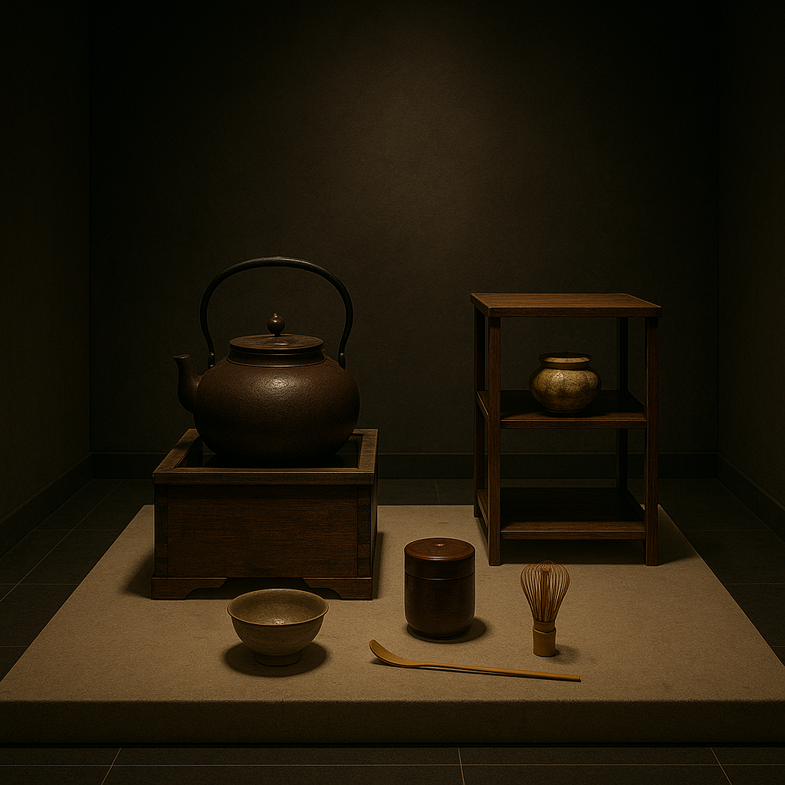

Fires, Flowers and Feudal Lords: The Muromachi Period’s Cultural Bloom Amid Civil War
===================================================================================
## Introduction – From Samurai Stronghold to Ashikaga Alley

When last we left off, the **Kamakura bakufu** crumbled under the weight of Mongol invasions, internal strife and Go‑Daigo’s rebellious dreams.  **Ashikaga Takauji** seized the moment and, after some dramatic backstabbing, marched into Kyoto to establish his own military government.  The court followed him into a new district of the capital—**Muromachi**—giving this era its name.  Thus begins the **Muromachi period** (1336–1573), also known as the Ashikaga period.  If Kamakura was the age of samurai consolidation, Muromachi is the age of **fracture and fusion**: a time when poets and painters thrived even as warlords burned cities to the ground.

The Muromachi years are notoriously complex.  For nearly half a century, two rival imperial courts—the northern and southern—fought for legitimacy.  Even after the Ashikaga shoguns unified the throne, their authority remained precarious.  Feudal lords (daimyo) carved out semi‑autonomous domains, leading to century‑long civil wars.  Yet amid the chaos, Zen monks brewed the tranquil ritual of the **tea ceremony**, artists perfected **ink painting**, and dramatists crafted the ethereal world of **Noh theatre**.  It’s an era where you could attend a tea gathering in the morning and, by afternoon, watch your neighbour’s castle go up in flames.

## The Ashikaga Ascendancy: Early Muromachi

### Two Courts, One Shogun

Following the **Kenmu Restoration**, Ashikaga Takauji initially backed Emperor **Go‑Daigo** but then turned against him, proclaiming a new emperor in Kyoto.  Go‑Daigo fled to Yoshino, establishing the **Southern Court**, while Takauji’s emperor reigned in Kyoto—the **Northern Court**.  This **Northern and Southern Courts period** (Nanbokuchō, 1336–1392) witnessed continual conflict.  Takauji took the title of **shogun** in 1338, but “complete control of Japan eluded him”.  Warlords exploited the chaos to expand their power, undermining Ashikaga authority.

### Yoshimitsu’s Moment of Glory

The Muromachi shogunate reached its zenith under the third shogun, **Ashikaga Yoshimitsu** (r. 1368–1394).  According to Britannica, Yoshimitsu “managed to eliminate his rivals and settle a long‑standing split in the imperial line, creating an era of stability that lasted several decades”.  He brokered a peace between the Northern and Southern courts in 1392, unified the country (for a time) and patronised the arts.  To showcase his wealth, Yoshimitsu built the **Kinkakuji** or **Golden Pavilion** in Kyoto—an extravagant villa covered in gold leaf.  After his death it became a Zen temple, but its shimmering reflection in the pond still dazzles visitors today.

Yoshimitsu also opened diplomatic and trade relations with China’s Ming dynasty, sending tribute missions and importing silk and ceramics.  Trade enriched both shogunate and coastal merchants, leading to economic growth.  Meanwhile, Zen monks acted as cultural intermediaries, translating Chinese texts and introducing artistic styles.  For a brief shining moment, it seemed Muromachi Japan might mirror the elegance of Heian without the stagnation.

## Culture in a Time of Chaos: Zen and the Arts

### Tea, Ink and Noh

Even as rival warlords skirmished, the Muromachi period witnessed a **flowering of culture**.  Zen Buddhism heavily influenced aesthetics.  Monks developed **ink wash painting** (sumi‑e) and sparse **landscape gardens** that emphasised asymmetry and negative space.  The Zen priest **Sesshū Tōyō** (1420–1506) perfected this style; his monochrome landscapes evoke misty mountains and flowing streams with a few confident brushstrokes.

The **tea ceremony** evolved from a simple monk’s refreshment into a codified art form.  While tea had been introduced earlier, it was during the Muromachi period that figures like **Murata Shukō** and shogun **Ashikaga Yoshimasa** refined the ritual.  According to World History Encyclopedia, by the mid‑15th century the ceremony had become “restrained and precise” and took place in sparsely furnished rooms designed to promote calm.  Participants shared bowls, contemplated the taste of powdered green tea (matcha) and appreciated calligraphy and flower arrangements displayed in the alcove (tokonoma).  The tea ceremony embodied Zen ideals of simplicity and mindfulness.

Parallel to these developments, the Muromachi court cultivated **Noh theatre**, an elegant stage art combining dance, music and poetry.  Rooted in earlier shrine rituals, Noh reached new heights under playwrights **Kan’ami** and his son **Zeami** in the 14th and early 15th centuries.  Performers donned wooden masks to portray gods, demons and tragic heroes.  Lines were chanted rather than spoken, and movement was slow and stylised, echoing the era’s preoccupation with impermanence.  The Ashikaga shoguns, especially Yoshimitsu, patronised Noh troupes, making performances a fixture at court.

### Flower Arranging and Architecture

The appreciation of beauty extended to everyday objects.  **Ikebana**, the art of flower arranging, developed from offerings placed before Buddhist altars.  Practitioners sought harmony between flowers, stems, leaves and container, emphasising line and form over abundance.  Meanwhile, architecture embraced **simplicity and austerity**.  Following Yoshimitsu’s Golden Pavilion, shogun **Ashikaga Yoshimasa** (r. 1449–1473) constructed the **Ginkakuji** or **Silver Pavilion**, intended as his retirement villa but completed as a Zen temple.  The **Ryoan‑ji** garden, famous for its raked gravel and 15 carefully placed rocks, dates from this time as well.  These structures epitomise **wabi‑sabi**, a Japanese aesthetic that finds beauty in imperfection, aging and rustic simplicity.

## The Onin War and the Birth of the Sengoku Age

### A War with No Winners

While cultural blossoms flourished, politics rotted.  In **1467**, a dispute over the shogunal succession sparked the **Onin War**.  Rival clans—the **Hosokawa** and **Yamana**—sided with different contenders for shogun.  What began as a succession dispute escalated into a decade‑long civil war that “destroyed most of Heiankyo” and plunged Japan into an era of “bitter rivalries, fighting and treachery”.  The conflict ravaged Kyoto; temples burned, palaces collapsed and nobles fled.  By its conclusion in **1477**, there was no clear victor, and central authority lay in ashes.  The Onin War is often considered the dawn of the **Sengoku period** (“Country at War”), a century of endemic warfare.

### Castles and Clans

With Kyoto in ruins and the Ashikaga shoguns powerless, regional **daimyo** filled the vacuum.  They built **castles** (yamashiro) on hilltops or in fortified towns.  As World History Encyclopedia notes, castles sprouted across the landscape, featuring wooden towers atop stone bases, narrow windows for archers and traps such as boulders on ropes ready to squash invaders.  Surrounding these strongholds, towns (jōkamachi) developed, becoming economic hubs.

Powerful clans like the **Oda**, **Takeda**, **Uesugi** and **Mōri** carved out territories.  Alliances shifted constantly; betrayal became a political art.  Peasants suffered as armies requisitioned crops and forced men into service.  Yet warfare also spurred innovation: commanders experimented with **firearms** introduced by the Portuguese in **1543**, and new tactics emphasised massed infantry over cavalry charges.  The Sengoku period, while destructive, forged the leaders who would ultimately unify Japan.

## European Contact and Christianity

### The Arrival of the Southern Barbarians

In **1543**, a Chinese ship carrying Portuguese traders drifted onto **Tanegashima** island.  The locals were intrigued by the foreigners’ **arquebuses** (matchlock guns), and soon Japanese smiths were reproducing the weapons.  Three years later, the Jesuit missionary **Francis Xavier** arrived in Kagoshima, ushering in a wave of **Christianity**.  Daimyo eager for firearms allowed missionaries to preach; some converted out of genuine faith, others for trade advantages.  Christianity gained a foothold particularly in Kyushu.  However, its success alarmed Buddhist institutions and eventually the centralising shoguns who would follow.  For now, however, Western technology and religion became part of the Muromachi tapestry.

## Decline and the Rise of Oda Nobunaga

### Ashikaga Weakness

By the mid‑16th century, the **Ashikaga shoguns** were mere figureheads.  The article notes that “complete control of Japan eluded” even the first shogun Takauji, and later shoguns fared no better.  Succession disputes, lack of revenue and reliance on loyalist clans left the shogunate vulnerable.  In **1568**, warlord **Oda Nobunaga** marched into Kyoto, ostensibly to install **Ashikaga Yoshiaki** as shogun but quickly sidelined him.  Five years later, he expelled Yoshiaki altogether, effectively ending the Ashikaga shogunate.

### Nobunaga’s Harsh Reforms

Oda Nobunaga (1534–1582) was a brilliant yet ruthless leader.  He embraced firearms, reorganised armies and implemented policies that undercut traditional power holders.  He destroyed **Enryaku‑ji** monastery on Mount Hiei, long a Zen stronghold, after its warrior monks threatened his rule.  He encouraged trade by eliminating internal barriers and standardising weights and measures.  Nobunaga’s vision was of a unified Japan under a strong central authority.  Though he did not live to complete his mission—he was betrayed by a vassal in 1582—his actions set the stage for **Toyotomi Hideyoshi** and **Tokugawa Ieyasu** to finish the job.  The Muromachi period thus ends with the dawn of the **Azuchi–Momoyama era** (1568–1600), named after Nobunaga and Hideyoshi’s respective castles.

## Conclusion – Beauty in the Midst of Blades

The **Muromachi period** embodies the paradox of Japanese history: **artistic refinement thriving amid political upheaval**.  The Ashikaga shoguns never achieved the centralized power of their Kamakura predecessors, yet they fostered cultural innovations that define Japanese aesthetics to this day.  The graceful arcs of **Noh masks**, the muted tones of **ink wash landscapes**, the contemplative stillness of **Zen gardens** and the ritualised sipping of **matcha** all trace their lineage to this era.  Even **flower arranging** and **tea rooms** speak to a search for order and beauty in a world otherwise consumed by flames.

At the same time, the Onin War shattered Kyoto and inaugurated a century of **Sengoku** chaos.  Castles dotted the countryside; alliances shifted like sand; peasants bore the burden of endless warfare.  European guns and Christian missionaries added new elements to the mix.  The Muromachi period ended with **Oda Nobunaga** bulldozing the old order, clearing the path for national unification under Hideyoshi and the Tokugawa.  Our journey from prehistoric Jōmon cord‑marked pots to the Ashikaga’s gilded pavilions shows a society in constant motion—sometimes backward, often sideways but always creating anew.

As we move onward to the **Azuchi–Momoyama period**, watch how Nobunaga’s brutal energy and Hideyoshi’s ambition transform Japan yet again.  Expect castles to grow taller, swords to flash brighter and tea huts to become sanctuaries of tranquility amid conquest.

---
## Footnotes
1. **Ashikaga and political instability** – The Muromachi period (1338–1573) was named after the district of Kyoto where Ashikaga Takauji established his headquarters.  He and his heirs never fully controlled Japan; only under the third shogun Yoshimitsu did the shogunate briefly stabilise and reconcile the Northern and Southern courts.  Successor disputes later sparked the Ōnin War and prolonged civil strife.
2. **Onin War and Sengoku period** – The Ōnin War (1467–1477) erupted over a shogunal succession dispute between the Hosokawa and Yamana clans.  It devastated Kyoto, destroyed most of the city and inaugurated a century of “bitter rivalries, fighting and treachery,” commonly referred to as the Sengoku (Warring States) period.
3. **Cultural achievements** – Despite warfare, the Muromachi era produced outstanding cultural achievements influenced by Zen: the construction of the Golden Pavilion (1397) and Silver Pavilion (1483); the refinement of the tea ceremony into a precise ritual; development of ink wash painting by artists like Sesshū; minimalist Zen gardens such as Ryoan‑ji; and the emergence of Noh theatre, flower arranging and castle architecture.
4. **Ashikaga decline and Nobunaga’s rise** – Weak Ashikaga shoguns could not control warlords, leading to their eventual downfall.  In 1568, Oda Nobunaga seized Kyoto, exiled the last Ashikaga shogun in 1573 and initiated unification efforts that ended the Muromachi period.
## References
- **World History Encyclopedia**, “Muromachi Period,” describing the warlike nature of the period, the Onin War, cultural achievements like Kinkakuji, Ginkakuji, tea ceremony, Noh theatre, and the eventual overthrow by Oda Nobunaga.
- **Britannica**, “Muromachi period,” summarising Ashikaga Takauji’s establishment of the shogunate, Yoshimitsu’s stabilization, and the development of tea ceremony, flower arranging and Noh during a time of political disorder.
- **Additional sources** including Jesuit reports and historical chronologies for details on European contact and trade in the 16th century.