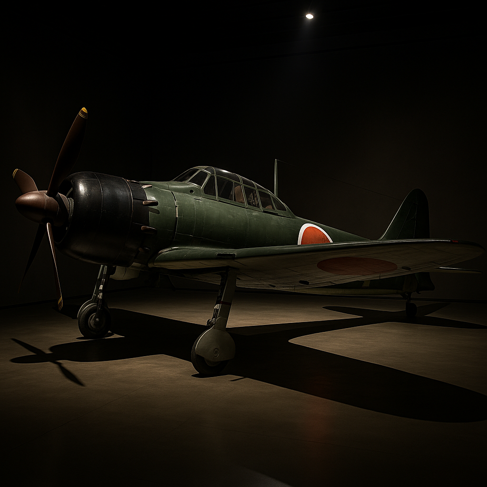

# From Democracy to Desolation – A Riveting Tour Through Japan’s Early Shōwa Era

When we last left Japan in our Taishō adventure, jazz bars were humming, rice riots had paved the way for universal manhood suffrage, and political parties vied for power under a sickly emperor.  Yet beneath the bobbed haircuts and democratic ballots lurked an unease.  The **Peace Preservation Law** had already hinted that the state was uncomfortable with too much freedom.  As the 1920s drew to a close, economic calamity and nationalist fervor would sweep away the fragile “Taishō democracy” and usher in a darker, tragic chapter: the **early Shōwa period** (1926‑1945).  This blog post follows Japan from the death of Emperor Taishō through the rise of militarism, the conquest of Asia, and the calamity of World War II, all while tying back to the seeds sown in the preceding era.  Prepare for coups, conspiracies, communiqués and catastrophic wars – with a dash of humor to help digest the heavy history.

## Adieu Democracy: The Collapse of Taishō Dreams

On **25 December 1926**, the ailing Emperor Yoshihito passed away, and his eldest son **Hirohito** ascended the throne as **Emperor Shōwa**.  His reign name, meaning **“bright peace,”** would prove painfully ironic.  The political environment he inherited was already fraying.  The **Great Depression** obliterated world markets, sending Japanese exports like silk and rice plummeting by **50 percent** and pushing unemployment to record heights.  The prosperity of the Taishō boom vanished, replaced by factory closures and impoverished farmers.  As hardship spread, the left – socialists, communists, tenant unions – agitated for relief.  Conservatives responded by doubling down on **kokutai**, the state ideology that held the emperor and nation as sacred and indivisible.  In the battle between bread and emperor, the emperor was winning.

The **Peace Preservation Law** of 1925 had already outlawed any movement seeking to change the political system or abolish private property.  By the late 1920s, thousands of activists were imprisoned.  Moderate politicians were increasingly targeted by extremists: **Prime Minister Hamaguchi Osachi** was shot by a nationalist in **1930** and later died from his wounds.  **Hara Takashi**, the commoner prime minister who symbolized Taishō democracy, had been assassinated back in 1921.  Politics by assassination became, as a foreign correspondent quipped, “a Japanese parliamentary procedure.”

## How to Build an Ultranationalist – Ingredients and Recipes

To understand the abrupt shift from democracy to dictatorship, we need to peek inside the ultranationalist kitchen.  The **Shōwa period** fused **samurai ethics (*bushidō*)**, **emperor worship**, and a simmering resentment toward Western interference.  New World Encyclopedia notes that ultranationalist ideology saw the **ABCD powers** (America, Britain, China, Dutch) as existential threats and argued that Japan could survive only through conquest.  Conservatives worried that rapid industrialization and Western fads (remember those moga from the Taishō period?) were eroding Japan’s “spirit.”  They romanticized the rustic, frugal warrior and demonized cosmopolitan urbanites.  Militarist societies like the **Black Dragon Society** and **League of Blood** recruited students, monks and even housewives, preaching that sacrifice for the emperor was the highest virtue.  In this atmosphere, moderate politicians appeared effete; generals seemed decisive.  The masses, battered by depression and hungry for leadership, listened.

Resentment toward the West had concrete sources.  The **Washington Naval Conference** of 1921‑1922 limited Japan’s battleships and carriers to **60 percent** of the tonnage allotted to the United States and Britain (a 5:5:3 ratio).  Many Japanese viewed this as an insult.  The **U.S. Immigration Act of 1924**, which banned Japanese immigration, further fueled xenophobia.  Already angry about the rejection of Japan’s racial equality clause at the 1919 Paris Peace Conference, nationalists concluded that the West would never treat Japan as an equal partner.  Better to carve out an empire than beg at European tables.

## Economic Freefall – The Showa Depression

The global economic collapse hit Japan like a tsunami.  Silk exports, the lifeblood of rural households, collapsed; farmers who had borrowed to buy fertilizer and equipment now faced foreclosures.  Urban unemployment bred protests and violent strikes.  The government attempted austerity to maintain the gold standard, but deflation only made things worse.  By **1932**, rice and silk prices had bottomed out; exports had halved; and hunger was widespread.  Extremist movements gained traction because they promised tangible solutions: land reform, military expansion to secure resources, and destruction of corrupt party politics.  Democracy seemed ineffective in the face of crisis.

## Murder, She Wrote – The Politics of Assassination

As the economy spiraled, Japan entered a bizarre period where **assassins wrote policy**.  Ultranationalist cells plotted to “purify” the nation by killing “corrupt” politicians and businessmen.  In **1932**, the **League of Blood Incident** saw a group of radicals murder the head of Mitsui and ex-minister Takuma; their goal was to assassinate twenty wealthy elites.  That May, junior navy officers invaded Prime Minister **Inukai Tsuyoshi’s** residence and shot him dead in the **May 15 Incident**.  The perpetrators were given light sentences, treated almost as misguided patriots.  The message was clear: bullets now had more influence than ballots.

The climax came on **February 26, 1936**, when about **1,500 ultranationalist army troops** occupied central Tokyo, killed several officials and demanded a **“Shōwa Restoration”** – a return to direct imperial rule.  For three tense days, tanks and machine guns blocked the streets while radio broadcasts kept the populace guessing.  The coup failed only after Emperor Hirohito personally ordered loyal troops to suppress the rebels.  Although the plotters were executed, the incident demonstrated that the military had become Japan’s ultimate political arbiter.  Civilian government never recovered its authority.

## False Flags and Puppet States – The Manchurian Adventure

The ultranationalists’ dream of empire needed a proving ground.  In **September 1931**, officers of the **Kwantung Army** blew up a section of railway near **Mukden** (Shenyang) in China’s Manchuria and blamed Chinese “saboteurs.”  New World Encyclopedia explains that the army used the explosion as a pretext to **invade Manchuria**, quickly seizing control while the civilian cabinet protested ineffectively.  Within months, the Kwantung Army had conquered the region and established the puppet state of **Manchukuo**.  When the League of Nations condemned the invasion, Japan simply **withdrew from the League**, signaling its rejection of the international order.  The Mukden Incident illustrated how the military operated independently of the government.  It also showed how a false flag operation could justify aggression – a tactic that would return in 1937.

## An Empire on the March – The Second Sino‑Japanese War

Emboldened by success in Manchuria, Japan’s army looked south.  On **July 7, 1937**, shots were fired near the **Marco Polo Bridge** outside Beijing.  The army claimed Chinese forces had attacked and used this as a casus belli to launch a full‑scale invasion.  Within weeks, the Japanese captured **Beijing** and soon pushed down the major railway lines, occupying coastal cities and advancing toward the Chinese capital **Nanjing**.  According to New World Encyclopedia, Japanese troops committed **war atrocities** during the capture of Nanjing, resulting in a massacre of civilians and prisoners.  Scholars debate the death toll, but New World Encyclopedia notes that most estimates place it between **150,000 and 300,000** people.  Known as the **Nanjing Massacre** or “Rape of Nanking,” this six‑week orgy of slaughter and rape shocked the international community and stands as one of the darkest chapters in modern history.

The war bogged down despite early victories.  The Chinese Nationalists retreated inland, while guerrillas harassed supply lines.  Japan’s resources strained, but its leaders believed that victory required total commitment.  The conflict soon merged into World War II, with catastrophic consequences.

## Towards Global Conflagration – Alliances and Oil Embargoes

As the Sino‑Japanese war consumed resources, Japan sought allies and raw materials.  In **1940**, Japan joined **Germany and Italy** in the **Tripartite Pact**, creating the **Rome–Tokyo–Berlin Axis**.  That same year, Japanese troops occupied **French Indochina**, exploiting France’s weakness after its defeat by Germany.  The United States and Britain responded with an **oil embargo**.  Lacking domestic petroleum, Japan faced an existential crisis: its war machine would grind to a halt within months.  Rather than withdraw from China, Japanese leaders chose a gamble: seize the oil‑rich **Dutch East Indies** (Indonesia) and knock out the U.S. Pacific Fleet with a surprise attack.

On **December 7, 1941**, carrier-based aircraft struck **Pearl Harbor**, Hawaii, crippling the U.S. battleship fleet.  The attack was part of a broader offensive that overran Hong Kong, the Philippines, Malaya and Burma within months.  For a brief moment, Japanese forces seemed unstoppable.  But the tide turned at **Midway** in June 1942.  American industry and code‑breaking prowess reversed Japanese advances.  The long, bloody fight across the Pacific would eventually devastate Japan.

## Fire and Fury – Hiroshima, Nagasaki and Total Defeat

As defeat loomed, Japanese cities faced relentless air raids.  **Tokyo** was firebombed in March 1945, causing about 100,000 deaths in a single night.  But nothing compared to the new weapon unveiled in August.  On **August 6, 1945**, an American B‑29 dropped an atomic bomb over **Hiroshima**, killing an estimated **140,000 people** by the end of the year, according to the International Campaign to Abolish Nuclear Weapons (ICAN).  Three days later, a second bomb destroyed **Nagasaki**, killing around **74,000**.  At the same time, the Soviet Union invaded Manchuria.  Facing annihilation, Emperor Hirohito announced Japan’s surrender on **August 15, 1945**.  The war was over; the early Shōwa militarist experiment lay in ruins.

## The Aftermath – Occupation and Reckoning

Japan’s defeat resulted in an unprecedented **seven‑year Allied occupation**.  Under General **Douglas MacArthur**, the country was demilitarized, democratic reforms were enacted and women gained the right to vote.  Article 9 of the new constitution renounced war.  War crimes trials prosecuted military and political leaders, although Emperor Hirohito retained his throne as a symbolic monarch.  The occupation dismantled some **zaibatsu** conglomerates, encouraged unionization and laid the groundwork for the postwar economic miracle.  But that is a story for another blog post.  The early Shōwa era, with its tragic arc from democracy to desolation, leaves profound lessons about the fragility of freedoms and the dangers of unchecked nationalism.

## Bridging from Taishō to Shōwa – Reflections and Humor

In our Taishō chapter we saw Japan flirt with democracy, feminism and jazz.  Now we’ve watched that flirtation curdle into militarism, war and nuclear devastation.  The continuity is striking: the **Peace Preservation Law** that silenced socialists in 1925 became the tool to suppress all dissent in the 1930s.  The **Washington Naval Treaty** ratio that seemed an insult paved the way for resentment.  The **rice riots** that proved the people’s power inadvertently taught militarists that violence works.  Democracy’s failure to ease economic pain allowed generals to step in.  The moga’s bobbed hair became the soldier’s buzz cut.

Amid these bleak themes, humor still flickered in Japanese society.  Satirists dubbed the March of 1932 “the March of Folly,” while popular songs mocked politicians who “changed cabinets more often than kimonos.”  When the navy attacked Pearl Harbor, one wag quipped that Japan had taken on “America, Britain, China and one Dutchman, and forgotten to invite their own parliament.”  Underground cartoonists drew samurai riding horses backward into battle.  Even in dark times, laughter remained a subversive act.

The early Shōwa period reminds us that modernization is not linear.  Democracies can crumble.  National pride can turn toxic.  And yet, from the ruins of 1945 would rise a resilient, peaceful nation.  In our next installment, we will explore how Japan emerged from occupation to become an economic powerhouse.  But for now, we end our tale with the wisdom that peace and democracy must be nurtured – lest they vanish as quickly as a jazz melody fading into wartime silence.

---
### Footnotes
1. Japan’s exports collapsed during the Great Depression, with prices of silk and rice dropping by half, causing widespread unemployment and social agitation.
2. Ultranationalist ideology combined samurai ethics, emperor worship and xenophobia; it warned that the ABCD powers threatened Japan and that war was the solution.
3. The Washington Naval Conference limited Japanese naval armament to a 5:5:3 ratio compared to Britain and the United States, a source of nationalist resentment.
4. The U.S. Immigration Act of 1924 banned Japanese immigration, worsening anti‑Western sentiment.
5. Economic hardship and ultranationalist propaganda led to assassinations of politicians: Prime Minister Hamaguchi Osachi was killed by a nationalist in 1930; Prime Minister Inukai Tsuyoshi was assassinated during the May 15 Incident in 1932.
6. The February 26, 1936 Incident saw about 1,500 ultranationalist soldiers occupy Tokyo and demand a “Shōwa Restoration”; Emperor Hirohito personally ordered its suppression.
7. In September 1931 the Kwantung Army staged an explosion near Mukden as a pretext to invade Manchuria; it conquered the region and established the puppet state Manchukuo, prompting Japan’s withdrawal from the League of Nations.
8. The Second Sino‑Japanese War began with the Marco Polo Bridge Incident in July 1937; Japanese forces captured Beijing and advanced along railway lines, committing atrocities such as the Nanjing Massacre.  The massacre’s death toll is estimated between 150,000 and 300,000.
9. Japan joined Germany and Italy in the Tripartite Pact in 1940 and occupied French Indochina; subsequent oil embargoes pushed Japan toward war in the Pacific.
10. Atomic bombs dropped on Hiroshima and Nagasaki in August 1945 killed approximately 140,000 and 74,000 people respectively.
11. After the war, Allied forces occupied Japan for seven years, enacted democratic reforms and demilitarized the nation.
### References
* “Shōwa period.” **New World Encyclopedia**. This article provides details on Japan’s political transition, ultranationalist ideology, the Washington Naval Treaty, the Great Depression’s impact, political assassinations, the Mukden Incident, the Second Sino‑Japanese War, and the early Shōwa military state.
* “Nanjing Massacre.” **New World Encyclopedia**. Gives background on the massacre and notes that mainstream estimates of the death toll range between 150,000 and 300,000.
* **International Campaign to Abolish Nuclear Weapons (ICAN)**. Reports that by the end of 1945 the atomic bombings killed approximately 140,000 people in Hiroshima and 74,000 in Nagasaki.
* **Japan Experience** — *Taishō & Early Shōwa Japan History*. Provides context on the Peace Preservation Law, Amakasu Incident, and lingering Taishō cultural trends leading into the Shōwa period.